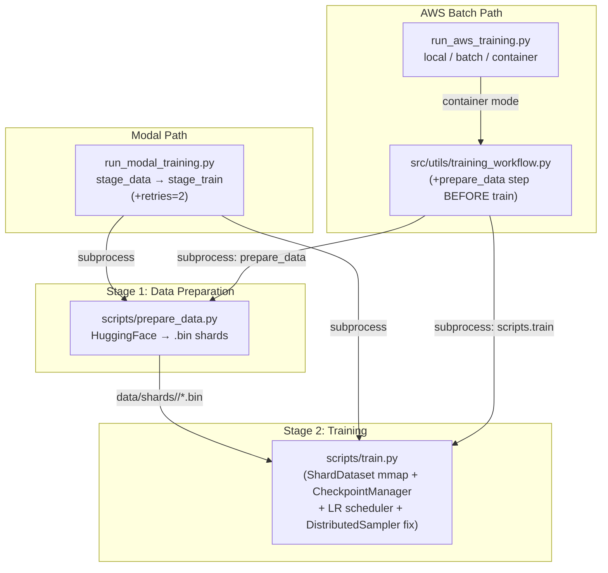

# T-MoE Pre-Scale Implementation Plan

This plan executes in 4 phases: dead code removal, critical bug fixes, training quality upgrades, and infra hardening. Changes are ordered by risk — deletions first, then targeted surgical edits to the live training path.

---

## Architecture After This Plan



---

## Phase 1 — Dead Code Removal

**11 files deleted. No logic changes.**

| File | Why |

|------|-----|

| `scripts/eval.py` | `raise NotImplementedError` — breaks CI, misleads readers |

| `scripts/generate.py` | Same |

| `src/training/trainer.py` | Never called from any live path. Duplicates `scripts/train.py` |

| `src/utils/experiment.py` | `build_model()`, `build_dataloaders()`, `build_optimizer()` never invoked |

| `src/utils/logging.py` | Only called by dead `Trainer` |

| `src/metrics/training_metrics.py` | `TrainingMetricsTracker` only used by dead `Trainer` |

| `run_pipeline.py` | Fully subsumed by `run_aws_training.py`'s inline ingestion logic |

| `config.yaml` | Contains `compute`, `device`, `data_ingestion` sections ignored by all active scripts. `experiments/*.yaml` are the real configs |

| `__init__.py` (root) | Root-level package `__init__.py` conflicts with `sys.path.insert(0, ...)` in every entry point |

| `infra/dataset/ensure_dataset.py` | Third copy of check-then-ingest; `run_aws_training.py` already does this inline |

| `experiments/gptneo_125m_metabolic.yaml` | Superseded by `v2`; `v2` docstring explains all deltas |

Also: remove the now-unused imports of `src/utils/experiment.py`, `src/utils/logging.py`, `src/metrics/training_metrics.py` from `src/training/__init__.py`, `src/utils/__init__.py`, and `src/metrics/__init__.py`.

---

## Phase 2 — Critical Bug Fixes

### 2a — `ShardDataset`: replace in-RAM concat with memory-mapped reads

**File:** [`scripts/train.py`](scripts/train.py) — `ShardDataset.__init__` and `__getitem__` (lines 63–94)

**Problem:** `self.data = np.concatenate(self.tokens)` loads every shard entirely into RAM. For C4 (1 TB), this OOMs.

**Fix:** build a cumulative offset table at init time, then use `np.memmap` per shard in `__getitem__`:

```python
class ShardDataset(Dataset):
    def __init__(self, shard_dir: Path, split: str, seq_len: int):
        self.seq_len = seq_len
        self.shards = sorted(shard_dir.glob(f"{split}_shard_*.bin"))
        if not self.shards:
            raise FileNotFoundError(...)

        # Read only headers — no data loaded into RAM
        self.shard_sizes: list[int] = []
        for path in self.shards:
            with open(path, "rb") as f:
                count = struct.unpack("<Q", f.read(8))[0]
            self.shard_sizes.append(count)

        # Cumulative token offsets for O(log N) shard resolution
        self.cumulative = [0]
        for s in self.shard_sizes:
            self.cumulative.append(self.cumulative[-1] + s)

        total_tokens = self.cumulative[-1]
        self.n_seqs = (total_tokens - 1) // seq_len

    def __len__(self):
        return self.n_seqs

    def __getitem__(self, idx):
        global_start = idx * self.seq_len
        global_end   = global_start + self.seq_len + 1   # +1 for labels

        tokens = np.empty(self.seq_len + 1, dtype=np.int64)
        filled = 0
        pos = global_start

        while filled < self.seq_len + 1:
            # Binary search: which shard owns `pos`?
            shard_idx = bisect.bisect_right(self.cumulative, pos) - 1
            shard_idx = min(shard_idx, len(self.shards) - 1)

            local_offset = pos - self.cumulative[shard_idx]
            available = self.shard_sizes[shard_idx] - local_offset
            need = (self.seq_len + 1) - filled

            mm = np.memmap(
                self.shards[shard_idx], dtype=np.uint16, mode="r",
                offset=8 + local_offset * 2,   # skip 8-byte header
                shape=(min(available, need),),
            )
            chunk = np.array(mm, dtype=np.int64)
            tokens[filled : filled + len(chunk)] = chunk
            filled += len(chunk)
            pos += len(chunk)

            if pos >= self.cumulative[-1]:  # wrap around
                pos = 0

        x = torch.from_numpy(tokens[:-1])
        y = torch.from_numpy(tokens[1:])
        return x, y
```

Add `import bisect` at the top of `scripts/train.py`.

### 2b — `DistributedSampler.set_epoch()` missing

**File:** [`scripts/train.py`](scripts/train.py) — training loop StopIteration handler (line 563–564)

**Problem:** Every epoch all ranks see the same sample order — a correctness bug.

**Fix:** track epoch count and call `set_epoch` when the dataset wraps:

```python
# Before the training loop, add:
current_epoch = 0

# Replace the StopIteration block (lines 562–565):
        except StopIteration:
            current_epoch += 1
            if is_distributed and train_sampler is not None:
                train_sampler.set_epoch(current_epoch)
            train_iter = iter(train_loader)
            x, y = next(train_iter)
```

Also expose `train_sampler` outside the `if is_distributed` block so it is accessible in the loop (currently it is only defined in the `if is_distributed` branch).

### 2c — AWS container mode: broken data pipeline

**Problem:** `run_container_mode` downloads raw JSONL from S3 to `/tmp/tmoe_data`, but `scripts/train.py::ShardDataset` reads packed `.bin` shards. Training crashes with `FileNotFoundError: No shards found`.

**Root cause:** `src/utils/training_workflow.py::execute_training_workflow()` calls `scripts.train` directly, but never converts the downloaded JSONL into shards first.

**Fix in [`src/utils/training_workflow.py`](src/utils/training_workflow.py):** insert a `prepare_data` subprocess step before the training call, pointing it at the shard output directory:

```python
def execute_training_workflow(experiment_config, cache_dir: str):
    import subprocess
    from omegaconf import OmegaConf
    from src.project_types import EXPERIMENTS_DIR

    config_name = experiment_config.get("experiment_name", "experiment")
    config_path = EXPERIMENTS_DIR / f"{config_name}.yaml"

    dataset_key = OmegaConf.select(experiment_config, "dataset.dataset_key",
                                   default="wikitext-2")
    shard_dir = Path("/tmp/tmoe_shards") / dataset_key
    output_dir = Path("/tmp/tmoe_outputs") / config_name
    output_dir.mkdir(parents=True, exist_ok=True)

    # Step 1: prepare shards (idempotent — skips if already done)
    existing_shards = list(shard_dir.glob("train_shard_*.bin")) if shard_dir.exists() else []
    if not existing_shards:
        prep_cmd = [
            sys.executable, "-m", "scripts.prepare_data",
            "--config", str(config_path),
            "--out-dir", str(shard_dir),
        ]
        subprocess.run(prep_cmd, check=True)

    # Step 2: train (same as Modal stage_train)
    num_gpus = OmegaConf.select(experiment_config, "distributed.num_gpus", default=1)
    train_cmd = (
        ["torchrun", "--standalone", f"--nproc_per_node={num_gpus}"]
        if num_gpus > 1
        else [sys.executable]
    ) + ["-m", "scripts.train", "--config", str(config_path),
         "--output-dir", str(output_dir)]

    subprocess.run(train_cmd, check=True)
    return str(output_dir), _read_last_checkpoint_metrics(output_dir)
```

Note: `scripts/train.py` currently hardcodes `shard_dir = Path("data/shards") / dataset_key`. Add a `--shard-dir` CLI flag to `scripts/train.py` so the container can point it at `/tmp/tmoe_shards/<dataset>` without relying on the `data/` symlink trick.

### 2d — `run_aws_training.py` attribute access crash

**File:** [`run_aws_training.py`](run_aws_training.py) line 441

**Problem:** `cache_dir = experiment_config.compute.aws.cache_dir` crashes with `omegaconf.errors.ConfigAttributeError` if the experiment YAML does not have a `compute.aws` section (none of the current production configs do).

**Fix:**

```python
# line 441 — run_local_mode
cache_dir = OmegaConf.select(
    experiment_config, "compute.aws.cache_dir", default="/tmp/tmoe_data"
)
```

---

## Phase 3 — Training Quality Upgrades

### 3a — LR warmup + cosine decay

**File:** [`scripts/train.py`](scripts/train.py) — after `build_optimizer()`, before the training loop

`warmup_steps` is already defined in all experiment YAMLs. Add:

```python
import math
from torch.optim.lr_scheduler import LambdaLR

warmup_steps = cfg.training.get("warmup_steps", 0)

def _lr_lambda(step: int) -> float:
    if step < warmup_steps:
        return float(step) / max(1, warmup_steps)
    progress = float(step - warmup_steps) / max(1, max_steps - warmup_steps)
    return max(0.1, 0.5 * (1.0 + math.cos(math.pi * progress)))

scheduler = LambdaLR(optimizer, _lr_lambda)
```

In the training loop, after `optimizer.step()` / `scaler.step()`:

```python
scheduler.step()
```

In the logging block, change:

```python
lr = optimizer.param_groups[0]["lr"]
# → replace with:
lr = scheduler.get_last_lr()[0]
```

### 3b — Replace primitive `save_checkpoint` with `CheckpointManager`

**Problem:** `scripts/train.py`'s inline `save_checkpoint()` only saves on val loss improvement, overwrites a single file, and saves the full model state including frozen backbone weights (~500 MB per checkpoint).

**Plan:**

1. Delete the inline `save_checkpoint()` and `load_checkpoint()` functions from `scripts/train.py`.
2. Add a `trainable_only: bool = True` parameter to `CheckpointManager.__init__()` in [`src/training/checkpoint.py`](src/training/checkpoint.py).
3. In `CheckpointManager.save_checkpoint()`, filter the state dict when `trainable_only=True`:
```python
if self.trainable_only:
    state_dict = {k: v for k, v in state_dict.items()
                  if "lora_" in k or "router" in k}
```

4. In `scripts/train.py::main()`, instantiate `CheckpointManager`:
```python
from src.training.checkpoint import CheckpointManager

ckpt_manager = CheckpointManager(
    checkpoint_dir=str(out_dir / "checkpoints"),
    keep_last_n=cfg.training.get("keep_last_n_checkpoints", 3),
    save_best=True,
    trainable_only=True,
)
```

5. Replace the inline save call with two call sites:

   - At `eval_interval`: `ckpt_manager.save_checkpoint(..., is_best=(val_loss < best_val_loss))`
   - At `save_interval`: `ckpt_manager.save_checkpoint(..., is_best=False)` (periodic, regardless of val)

6. For `--resume`, use `ckpt_manager.load_checkpoint(model, optimizer, checkpoint_path=Path(args.resume))`.

Add `save_interval: 500` to experiment YAMLs that don't already have it (all current ones do).

### 3c — Reproducibility seeds

**File:** [`scripts/train.py`](scripts/train.py) — after `cfg = load_config(...)`, before `init_distributed()`:

```python
import random

seed = cfg.get("seed", 42)
random.seed(seed)
np.random.seed(seed)
torch.manual_seed(seed)
torch.cuda.manual_seed_all(seed)
```

Keep the existing per-rank seed offset `torch.manual_seed(cfg.get("seed", 42) + rank)` after `init_distributed()` — that's correct for DDP divergence.

---

## Phase 4 — Infra Hardening

### 4a — Add `retries=2` to Modal `stage_train`

**File:** [`run_modal_training.py`](run_modal_training.py) line 185

```python
@app.function(
    volumes={VOLUME_MOUNT: volume},
    gpu=GPU_TRAIN,
    memory=32768,
    timeout=60 * 60 * 12,
    retries=2,          # ← add this line
)
def stage_train(...):
```

Without retries, a spot preemption on a 12-hour run at hour 11 discards all progress. Retries with volume-persisted checkpoints allow resume from the last periodic save.

### 4b — Rename smoketest config and add `--shard-dir` to train script

**File:** `experiments/modal_test.yaml` → rename to `experiments/smoketest.yaml`

Add a prominent header:

```yaml
# DEV ONLY — steps: 2, used for CI smoke tests. Do not use for real runs.
```

Update the `_DEFAULT_CONFIG` in `run_modal_training.py` to reference the new name.

**File:** [`scripts/train.py`](scripts/train.py) — `parse_args()`

Add:

```python
parser.add_argument(
    "--shard-dir",
    type=str,
    default=None,
    help="Override shard directory (defaults to data/shards/<dataset_key>/).",
)
```

In `main()`, resolve shard dir:

```python
shard_dir = Path(args.shard_dir) if args.shard_dir else Path("data/shards") / dataset_key
```

This allows AWS container mode to point training at `/tmp/tmoe_shards/<dataset>` without the symlink hack.

### 4c — AWS: upload checkpoints in try/finally

**File:** [`run_aws_training.py`](run_aws_training.py) — `run_container_mode()`

Wrap the training call in `try/finally` so that a partial checkpoint is always uploaded to S3 even on training failure or preemption:

```python
def run_container_mode(args, pipeline_config, experiment_config) -> None:
    from omegaconf import OmegaConf
    cache_dir = OmegaConf.select(experiment_config, "compute.aws.cache_dir",
                                  default="/tmp/tmoe_data")
    download_dataset_from_s3(pipeline_config, cache_dir)

    output_dir = None
    try:
        output_dir, final_metrics = run_training(experiment_config, cache_dir)
    finally:
        if output_dir and not args.skip_upload:
            upload_outputs_to_s3(pipeline_config, output_dir)   # runs even on crash

    _log_completion(True, final_metrics, output_dir)
```

---

## File Change Summary

| File | Change |

|------|--------|

| `scripts/eval.py` | DELETE |

| `scripts/generate.py` | DELETE |

| `src/training/trainer.py` | DELETE |

| `src/utils/experiment.py` | DELETE |

| `src/utils/logging.py` | DELETE |

| `src/metrics/training_metrics.py` | DELETE |

| `run_pipeline.py` | DELETE |

| `config.yaml` | DELETE |

| `__init__.py` (root) | DELETE |

| `infra/dataset/ensure_dataset.py` | DELETE |

| `experiments/gptneo_125m_metabolic.yaml` | DELETE |

| `experiments/modal_test.yaml` | RENAME → `experiments/smoketest.yaml` |

| `scripts/train.py` | REFACTOR: mmap ShardDataset, DistributedSampler.set_epoch, LR scheduler, CheckpointManager, --shard-dir flag, seeds |

| `src/training/checkpoint.py` | REFACTOR: add `trainable_only` param |

| `src/utils/training_workflow.py` | REFACTOR: add prepare_data step before training |

| `run_aws_training.py` | REFACTOR: fix OmegaConf.select on line 441, try/finally in container mode |

| `run_modal_training.py` | REFACTOR: add retries=2, update _DEFAULT_CONFIG |

| `src/training/__init__.py` | REFACTOR: remove dead imports |

| `src/utils/__init__.py` | REFACTOR: remove dead imports |

| `src/metrics/__init__.py` | REFACTOR: remove dead imports |
